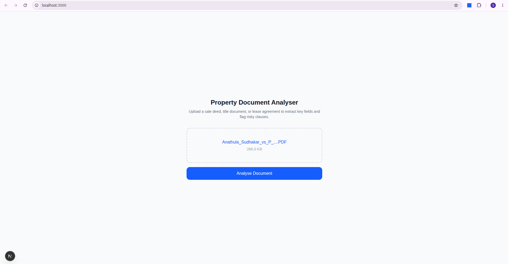
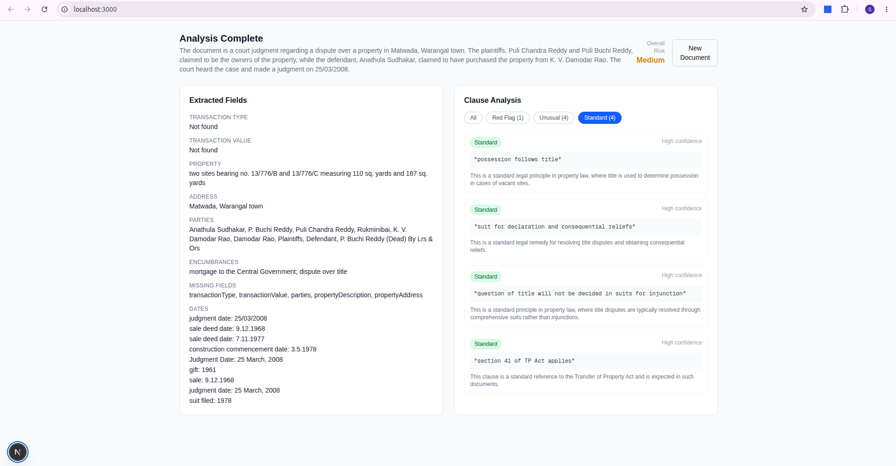

# Property Document Analyser

Upload a property PDF — sale deed, title document, or lease agreement — and get back structured legal analysis in seconds.





---

## What it does

- Extracts key fields: parties, property address, transaction type & value, dates, encumbrances
- Classifies every clause as **Standard**, **Unusual**, or **Red Flag**
- Gives an overall risk rating: Low / Medium / High
- Handles multi-page documents by chunking and merging results

---

## Stack

| Layer | Tech |
|---|---|
| Frontend | Next.js 14, React 19, Tailwind CSS |
| Backend | Express.js, TypeScript |
| LLM | Groq — Llama 3.3 70B |
| PDF parsing | pdf-parse |

---

## Getting started

### Prerequisites

- Node.js 18+
- A [Groq API key](https://console.groq.com)

### Backend

```bash
cd backend
npm install
```

Create `backend/.env`:

```
GROQ_API_KEY=your_key_here
```

```bash
npm run dev
# Runs on http://localhost:5000
```

### Frontend

```bash
cd frontend
npm install
npm run dev
# Runs on http://localhost:3000
```

---

## Limitations

- Text-based PDFs only — scanned/image PDFs are not supported (no OCR)
- CORS is locked to `localhost:3000` — update `backend/src/index.ts` for production
